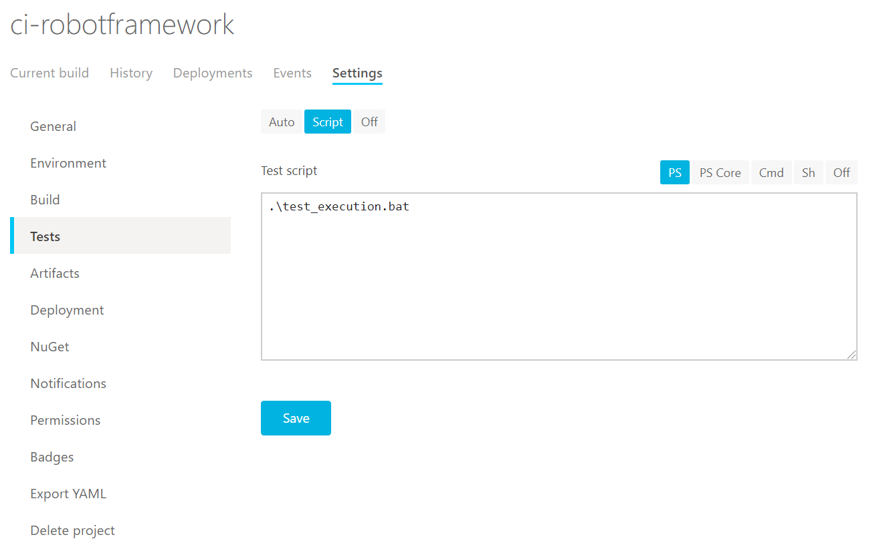

# CI-Robotframework

| System    | Badge |
| -------- | ------- |
| Appveyor Build  | [](https://ci.appveyor.com/project/Nepitwin/ci-robotframework)    |
| Appveyor Badge |[](https://ci.appveyor.com/project/Nepitwin/ci-robotframework/build/tests)     |
| Testspace Badge    | [](https://nepitwin.testspace.com/spaces/267312)    |

Robotframework example for build system usage by ui test automation by appveyor.

Check by Python table from appveyor which test worker supports your python version.

  * https://www.appveyor.com/docs/windows-images-software/#python

## Appveyor setup by yaml file

For github configuration create a appveyor.yaml file.

```
version: 1.0.{build}
image: Visual Studio 2017
install:
- cmd: >-
    set PATH=C:\Python37;C:\Python37\\Scripts;%PATH%

    python -m pip install --upgrade pip

    pip install wheel

    pip install robotframework

    pip install robotframework-whitelibrary
build: off
test_script:
- ps: robot -x xunit-result.xml -d result --nostatusrc Automation.robot
artifacts:
- path: result/
  name: results
on_finish:
- ps: >-
    $wc = New-Object 'System.Net.WebClient'

    $wc.UploadFile("https://ci.appveyor.com/api/testresults/junit/$($env:APPVEYOR_JOB_ID)", (Resolve-Path .\result\xunit-result.xml))
```


## Appveyor setup by web interface

Login to your appveyor account and establish a github project to build.

### Environment setup

  * Setup build worker image to Visual Studio 2017 for python 3.7.5 usage.
  * Setup a install script by powershell script

```
set PATH=C:\Python37;C:\Python37\\Scripts;%PATH%
python -m pip install --upgrade pip
pip install wheel
pip install robotframework
pip install robotframework-whitelibrary
```


### Test Setup

Execute robot framework files by a simple bat file or ps cmd. Most important argument is '--nostatusrc' to avoid Exit command -1 return from robot framework execution.

```
robot -x xunit.xml -d result --nostatusrc Automation.robot
```



### Artifacts

Artifacts deployment can store results as zip.


### Xunit Testing

To upload xunit files from robot to appveyor use web api. Importand don't use xunit parser from appveyor because xunit file from robotframework is junit xml file.

  * https://www.appveyor.com/docs/running-tests/

```
$wc = New-Object 'System.Net.WebClient'
$wc.UploadFile("https://ci.appveyor.com/api/testresults/junit/$($env:APPVEYOR_JOB_ID)", (Resolve-Path .\result\xunit-result.xml))
```


### Robot Results

Download artifact files and see robot files.


